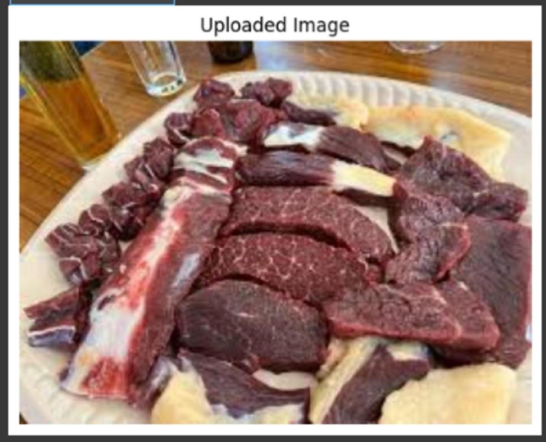
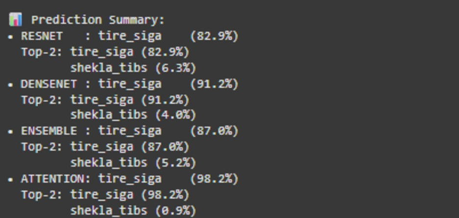
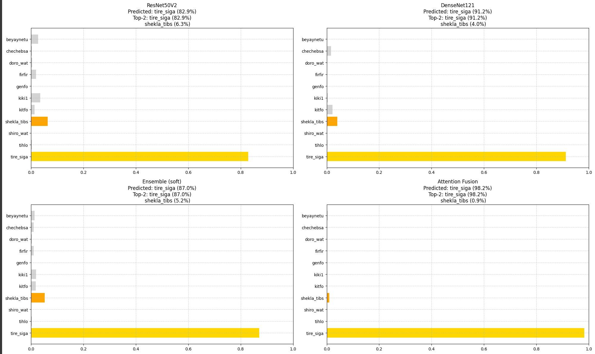

# SavorNet: Ethiopian Cuisine Classifier 🍽️🇪🇹

**SavorNet** is a state-of-the-art deep learning web application for classifying 11 traditional Ethiopian dishes. It leverages an adaptive attention fusion mechanism that combines features from DenseNet121 and ResNet50V2 using a two-layer attention network for optimal accuracy and interpretability.

---

## 🚀 Demo

Upload an image of Ethiopian food and the model will return top-2 predictions from:
- **DenseNet121**
- **ResNet50V2**
- **Soft Voting Ensemble**
- **SavorNet Attention Fusion**

It also shows bar chart visualizations of all class probabilities and a performance summary table.

---

## 📷 App Interface

| Upload Section | Prediction Output | Probability Charts |
|----------------|-------------------|--------------------|
|  |  |  |

---

## 🧠 Models Used

- **DenseNet121** trained on Ethiopian food dataset  
- **ResNet50V2** trained on the same dataset  
- **Soft Voting** ensemble strategy for improved prediction confidence
- **SavorNet (Attention Fusion)** Custom 2-layer attention module that adaptively fuses features from both models
---

## 📊 Test Accuracy

| Model        | Test Accuracy |
|--------------|---------------|
| DenseNet121  | 83.12%        |
| ResNet50V2   | 86.36%        |
| Ensemble     | 88.31%        |
| SavorNet     | **92.20%%**   |
---

## 🗂️ Classes

The model classifies the input into one of the following 11 Ethiopian dishes:

beyaynetu, chechebsa, doro_wat, firfir, genfo,kiki1, kitfo, shekla_tibs, shiro_wat, tihlo, tire_siga

1. **Clone the repository**:
   ```bash
   git clone https://github.com/yourusername/savornet-ethiopian-cuisine.git
   cd savornet-ethiopian-cuisine
   ```
2. **Install dependencies:**:   
   ```commandline
    pip install -r requirements.txt
   ```
   ```
3. **Run the Streamlit app:**:   
   ```commandline
    streamlit run savornet_app.py
   ```

## 📐 Input Format
Image Size: 512×512 (automatically resized)

Accepted Formats: .jpg, .jpeg, .png

## 👨‍💻 Author

Yoseph Negash

📧 yosephn22@gmail.com

📅 2025
